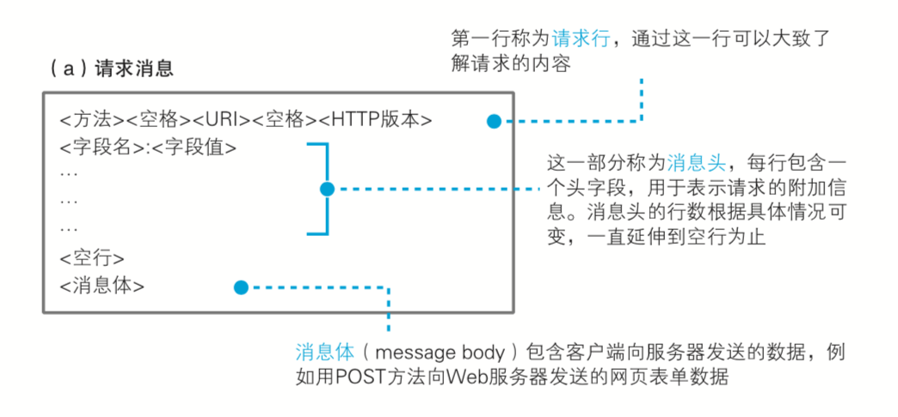

# Sqlite 网络是怎样连接的

淘宝手机客户端浏览商品是怎么获取到服务器数据的？这里会衍生出以下一些问题。

上图一些列问题反映了很多知识点，接下来会一个一个通俗点描述其工作原理。

### 从下面三个方面可以更加有一个直观认识
> 1. 客户端要做的事情
> 2. 网络传输要做的事情
> 3. 服务器要做的事情

### 1. 客户端要做的事情

不管是手机客户端还是pc，客户端发送内容到服务器都需要经过下面几个过程:
> 1. 生成http请求消息
> 2. 向dns服务器查询服务器的ip地址
> 3. 委托协议栈发送消息
> 4. 创建套接字Socket
> 5. 发送数据
> 6. 断开服务器连接

#### 1.1 生成http请求消息
Http请求消息是应用程序生成的，而且有一些第三方库很方便应用开发者生成请求消息内容，比如android应用程序可以用okhttp，ios应用程序可以用NSURLSession，go提供的net库等。但是http请求消息体都有其标准格式，如下图所示：

