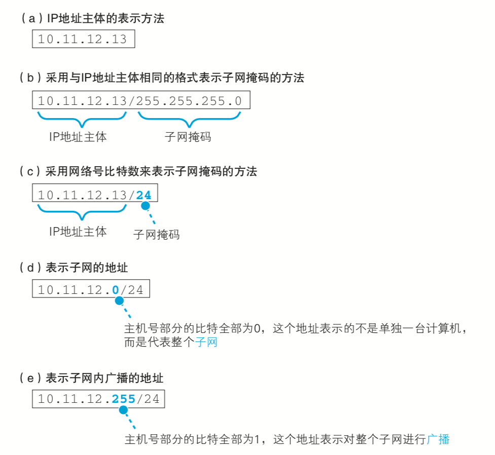
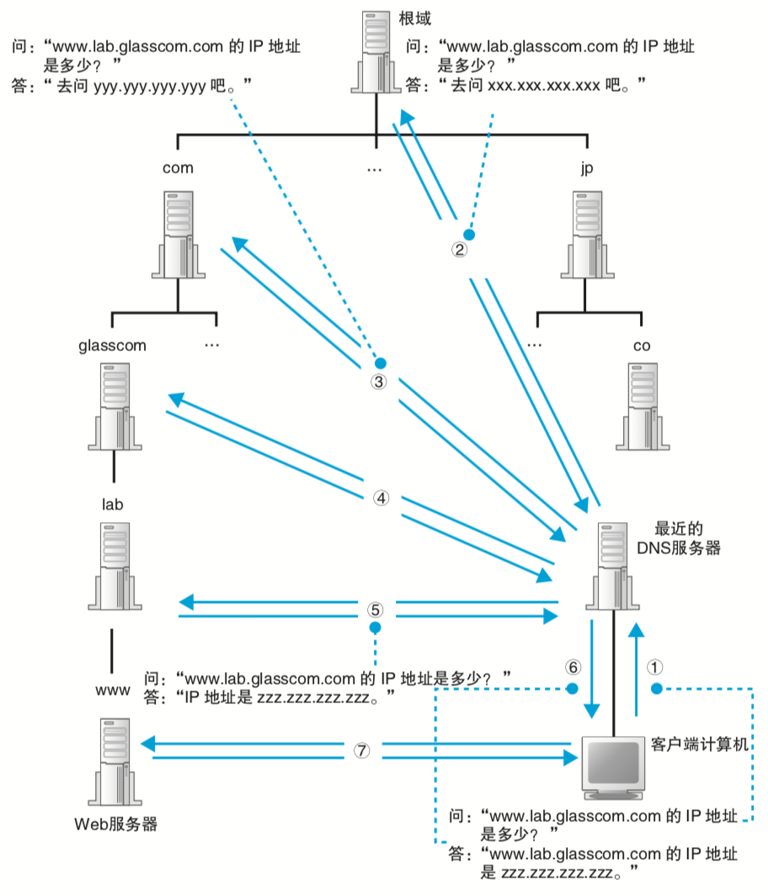

# 网络是怎样连接的

淘宝手机客户端浏览商品是怎么获取到服务器数据的？这里会衍生出以下一些问题。

上图一些列问题反映了很多知识点，接下来会一个一个通俗点描述其工作原理。

### 从下面三个方面可以更加有一个直观认识
> 1. 客户端要做的事情
> 2. 网络传输要做的事情
> 3. 服务器要做的事情

### 1. 客户端要做的事情

不管是手机客户端还是pc，客户端发送内容到服务器都需要经过下面几个过程:
> 1. 生成http请求消息
> 2. 向dns服务器查询服务器的ip地址
> 3. 委托协议栈发送消息
> 4. 创建套接字Socket
> 5. 发送数据
> 6. 断开服务器连接

#### 1.1 生成http请求消息
Http请求消息是应用程序生成的，而且有一些第三方库很方便应用开发者生成请求消息内容，比如android应用程序可以用okhttp，ios应用程序可以用NSURLSession，go提供的net库等。但是http请求消息体都有其标准格式，如下图所示：

http请求消息生成之后，由于应用本身不具备将消息发送到网络功能，这需要将这个任务交给操作系统来实现，但是交给操作系统之前，比如要将域名解析为对应的IP地址。如果本来就是通过IP直接访问，那么这个步骤就省略了。

#### 1.2 向dns服务器查询服务器的ip地址

这里先介绍下IP地址是什么？ 如下图所示：

主机号部分的比特全部为0或者全部为1时代表以下两种特殊的含义。
> 1. 主机号部分全部为0代表整个子网而不是子网中的某台设备。
> 2. 主机号部分全部为1代表向子网上所有设备发送包，即广播.

域名解析过程入下图www.lab.glasscom.com所示，肯定会先访问最近的一台DNS服务器，如果最近的DNS服务器没有存放域名对应信息。由于最近的DNS服务器没有存放www.lab.glasscom.com对应的信息，我们需要从顶往下找。最近的 DNS 服务器中保存了根域DNS服务器的信息，因此它会将来自客户端的查询消息转发给根域DNS服务器，根域服务器中也没有www.lab.glasscom.com这个域名，但根据域名结构可以判断这个域名属于com域，因此根域 DNS 服务器会返回它所管理的com域中的DNS服务器的IP地址。接下来最近的DNS服务器又会向com域的DNS服务器发送查询消息com域中也没有www.lab.glasscom.com这个域名的信息，和刚才一样com域服务器会返回它下面的 glasscom.com域的DNS服务器的IP地址。以此类推，只要重复前面的步骤，就可以顺藤摸瓜找到目标DNS服务器。整个过程如下图所示。

对于客户端来说，其实还有一部就是本地dns缓存，本地dns缓存也就是在/etc/hosts文件，这也是为啥我们可以在hosts文件中重定向域名对应的ip地址。