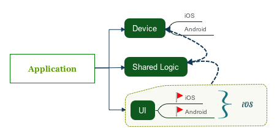
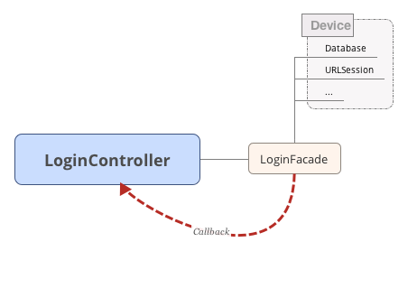
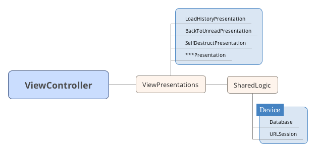

### 超信移动端架构设计

超信是一款即时通讯产品，产品定位类似Telegram私密聊天软件。通讯类APP主要关键复杂功能都集中在聊天室。在客户的方面，多设备同步，离线消息，数据库持久化，聊天室操作流畅性是几个难点。
很多公司在做Android，iOS两个产品时候会分成两个部门，然后各自写业务逻辑与服务器通讯，但是在产品功能实现过程中会发现很多业务逻辑都需要Android，iOS各自实现一遍。具体到某个功能时候团队协作一般是这样的：老板一个需求A->产品经理分析功能A各种细枝末节->技术团队分析功能A技术解决方案->Server定义功能A需要用到的Api->客户端联调Api功能。在产品实现阶段，不同部门之间沟通其实非常好时，最后一个阶段客户端不同平台团队都要去接功能，有时候即使清晰的Api文档都会导致参数传递不对，协议理解不对，协议调用时机不对导致各种Bug，这个应该是很多开发团队面对的问题。
超信为了解决这个问题采用共享逻辑开发方案，也就是逻辑层面，iOS，Android用一套代码，也有一些公司是采用这个方案，用C++写业务逻辑，然后Android将逻辑打包编译成so使用，iOS使用起来就相对方便多了。虽然我对C++不是很熟，但是Android调用C++ Api还是很蛋疼的，开发进度也会拉慢，调试起来也不方便。Google开发的J2objc是一个比较好的工具，超信也用了这个工具，它将java文件翻译成object-c文件，翻译过来的代码不难读懂。这个工具是开源的，对这个功能介绍可见文章[J2obc](http://kingxt.me/2015/11/05/J2objc/)。
在开始阶段，我们app的架构如下:
</img>
这个架构中，Device注册一些平台相关Api，例如Sqlite操作，Http请求等。这个架构那够复用大部分与UI无关的业务逻辑，将服务器返回的协议封装成DataModel。ShareLogic层提供UI访问逻辑接口，比如UserFacade，GroupChatFacade，PrivateChatFacade。这些接口都是通以面设计模式设计。比如一个登陆功能流程如下：
</img>
这个方案解决了逻辑层面代码重复问题，减少了沟通成本。
业务逻辑层以门面模式提供业务访问接口，然后通过Callback方式返回加工后的数据。
随着业务越来越复杂，聊天室里面很多功能，如果将所有功能都堆积在一个Controller中，这样Controller很难维护，这个时候我们将业务逻辑分拆到不同的Category中实现，如果需要在Controller的生命周期中切入逻辑，我们采用AOP思想，具体思想可以参考[Aspect](https://github.com/steipete/Aspects)。这样拆分后，我们用这套模式开发了一段时间，形成的代码结构大致就是**Controller+ModuleName的组织方式，ModuleName就是功能名称，比如一键到未读，转发，语音等。
这样的架构有一写弊端如下：
* 代码比较乱，父类定义的一个方法，可能被某个Category覆盖了。
* Aspect调试起来比较麻烦。
* 如果某个模块需要定义一个属性需要定义在主类里面或者通过Associate实现（不推荐）。
* 对业务逻辑调用的代码不能和Mac端复用。
我们现在采用的是一种MVPs模式来解决上面提到的问题，MVP模式想必大家有所了解。我们将Category中要实现的逻辑在Presentation中实现，这样一个ViewController会存在一个或者多个P，这也就是我将它取名MVPs的原因。开始我们打算将模块调用逻辑用Object-c写，想想Android其实也可以复用这块代码，UI层只需要处理ViewModel的渲染就行，不需要处理对业务逻辑调用，Presentation需要抽象出Controller或者说Activity的生命周期。

``` java
public interface ViewPresenter {
    public void viewDidLoad();

	public void viewDidAppear();

	public void viewDidDisappear();

	public void viewDidEnterBackground();

	public void viewDidEnterForeground();
    
    /**
    *iOS dealloc，
    *Android onDestroy
    */
	public void viewDidUnload();
}
```

各个平台在Controller的生命周期中调用Presentation对应的方法即可，这些调用完全可以放在统一一个父类里面处理即可。
</img>
将做过大型项目的同学应该知道，业务逻辑处理后的DataModel和界面需要使用的ViewModel其实存储一个包含关系，ViewModel应该包含DataModel，ViewModel还有一些界面渲染需要的属性。这里提一下，我们超信iOS客户端UI都是基于AutoLayout纯代码写的，没有一个通过Xib实现。这里我推荐大家使用[Masonry](https://github.com/SnapKit/Masonry)，这个框架简化了大家使用AutoLayout复杂度。我们Mac客户端也可以复用SharedLogic层里面的所有逻辑，里面没有任何UI接口调用。OSX需要的ViewModel，iOS需要的ViewModel，Android需要的ViewModel随着平台不同里面属性会不同。
